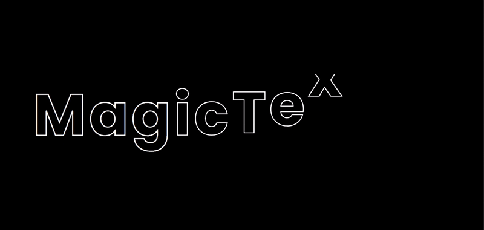
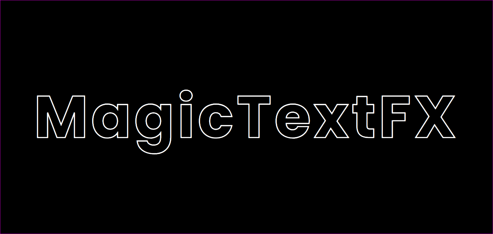

# GSAP MagicTextFX | Stunning Text Hover Animations

<a href="https://www.linkedin.com/in/dharmendraverma95/" target="_blank">LinkedIn Profile </a>

<a href="https://www.behance.net/dhirukumar" target="_blank">Behance Profile </a>

Textura is a project that utilizes CSS text animations to elevate your website's design. Whether you want to add subtle interactive effects or go all out with dynamic text animations, Textura offers a range of customizable features. You can easily create eye-catching hover effects that improve user experience, making your content feel more engaging. If you're aiming for a minimalist approach, you can also opt for the more subtle, "half-baked" features to maintain a clean design.

### Features
<ul>
  <li>CSS Text Animations: Enhance text interactions with smooth hover animations powered by CSS.
</li>
  <li>Minimalist Option: For a clean design, choose the half-baked features that offer subtle and minimal effects.</li>
  <li>Highly Customizable: Modify animation speed, style, and behavior to match your website’s theme.</li>

  <li>Responsive: Fully responsive animations that look great on all devices.</li>
  <li>Easy Integration: Simply add the provided CSS and JavaScript to your project for instant results.</li>
</ul>

# Preview

 

 

 

###### Lang
<ul>
  <li>Graphic Design Software: Adobe Illustrator, Photoshop, Figma (for mockups)</li>
  <li>Web Tools (Optional): HTML5, CSS3, JavaScript and GSAP for any digital presentations or landing pages</li>
  <li>Font Awesome (Optional for icons)</li>

</ul>

